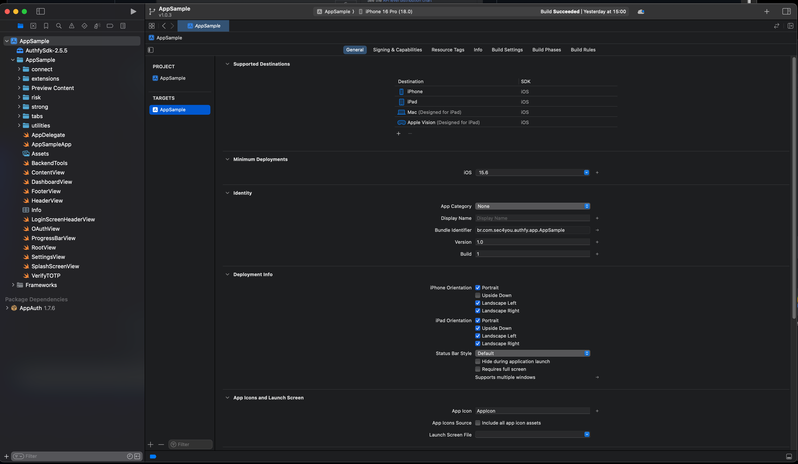
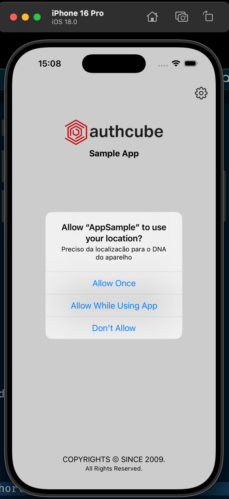
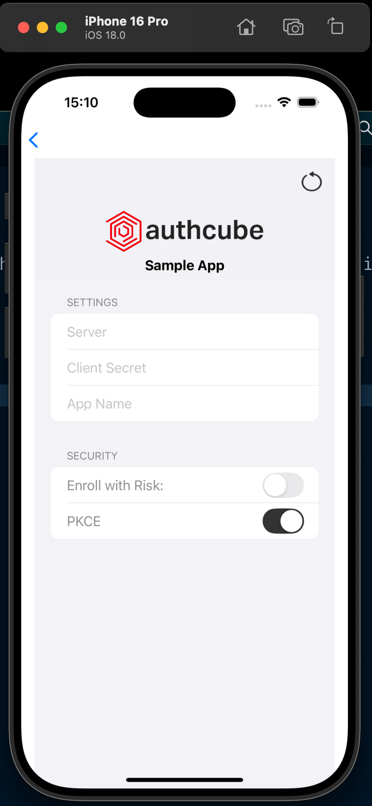
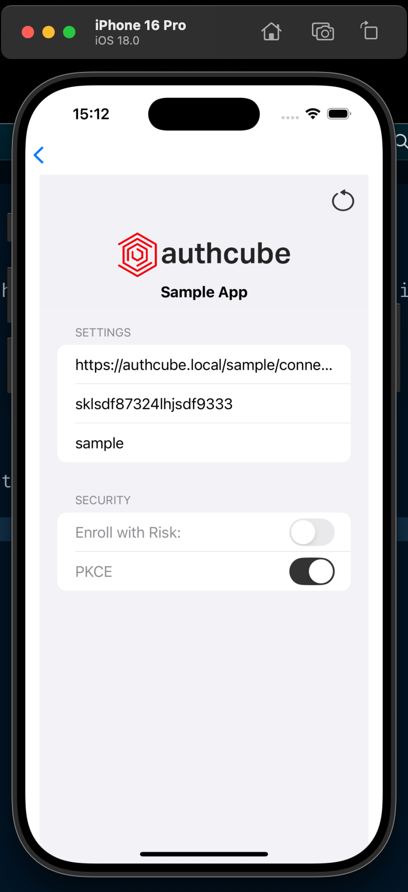

# sample-app-ios

Native Sample App for iOS

This Project is intended to be a **guideline** to who wants to use the AuthfySDK and its functionalities on your own application.

## License

This software is proprietary and protected under IT4YOU CONSULTORIA EM INFORMATICA LTDA's license. All rights reserved since 2009.

Please refer to the [LICENSE](./LICENSE) file in the repository for complete terms.

## Getting the Code

Getting the code is as simple as clone this repository on your machine.
Make sure you have the latest version so you can see how to use the newest functionalities.

## Versions

To be able to compile and run this application, you **MUST** have a Mac computer (Intel or ARM) with a MacOS System and XCode installed.

This application was created on an Intel Mac, with MacOS Sequoia 15.2 and XCode version 16.2

Previous versions might work as well, but some adjustments might be need to run the code, specially code from SwiftUI and newest iOS versions.

## Dependencies

The dependencies used in this project were (already included):

| Dependency  | Version | URL                                   |
| ----------- | :-----: | ------------------------------------- |
| AuthfySDK   |  2.5.5  |                                       |
| AppAuth-iOS |  1.7.6  | https://github.com/openid/AppAuth-iOS |

## Running this Application

# Step 1: Clone this repository

Run the following git command:

```sh
git clone git@github.com:authcube/sample-app-ios.git
```

# Step 2: Open the Project on XCode

1. Open XCode
2. Click on "Open Existing Project"
3. Navigate to the directory where the repository was cloned and click "Open"
4. The Application code will open on XCode



# Step 3: Running the Application on the Simulator

With the Project open, click on the "Play" Button, or use the shortcut "Command+R", if everything is fine, the application will start on the Simulator.



1. Click on the 'cog' to access the Settings screen



2. Fill all the fields with the information for your environment



3. Click the "Back" arron on the Left Top of the Screen, and you will be good to go
